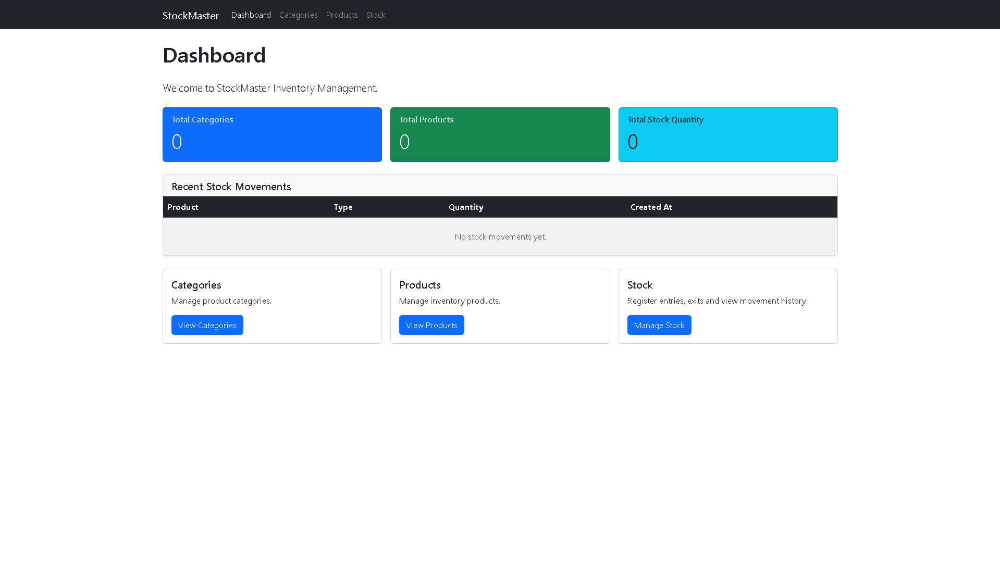
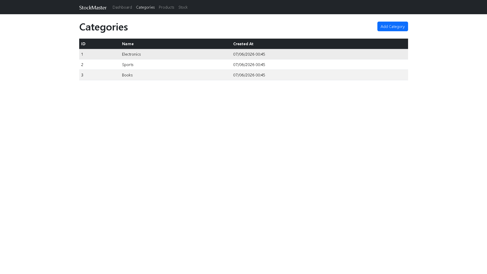
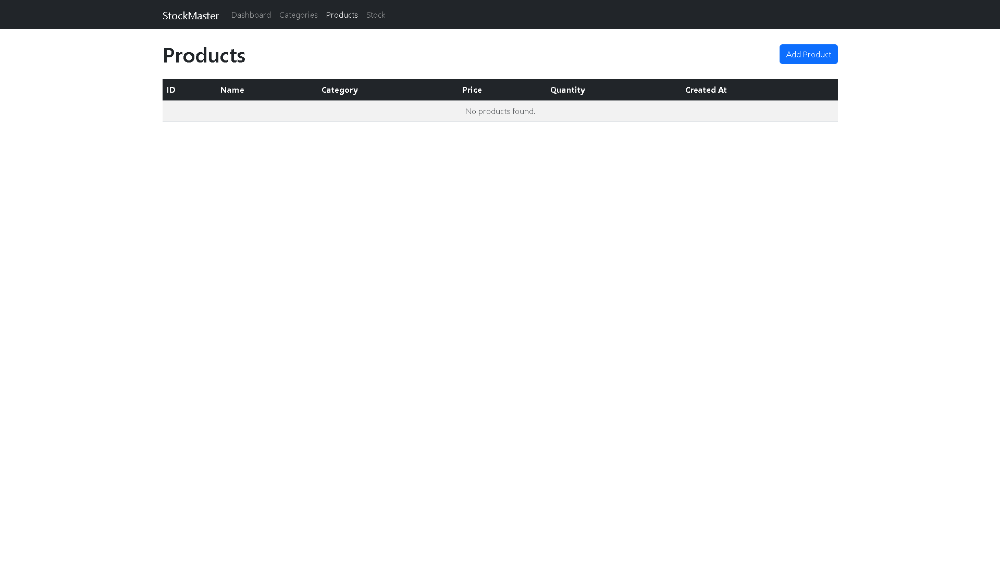
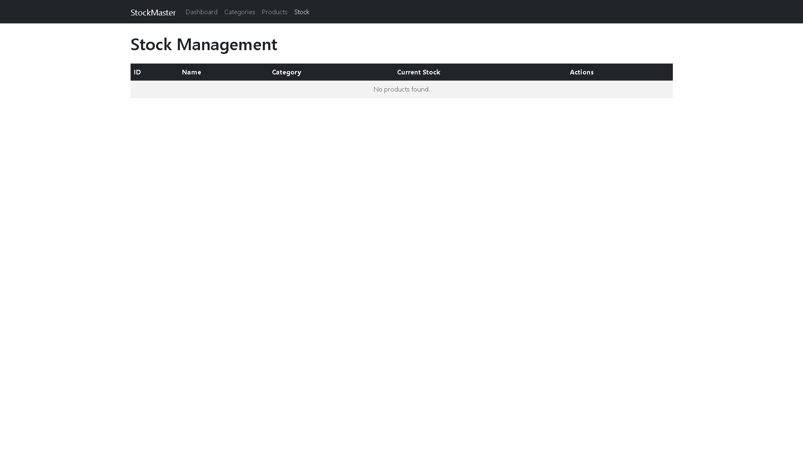
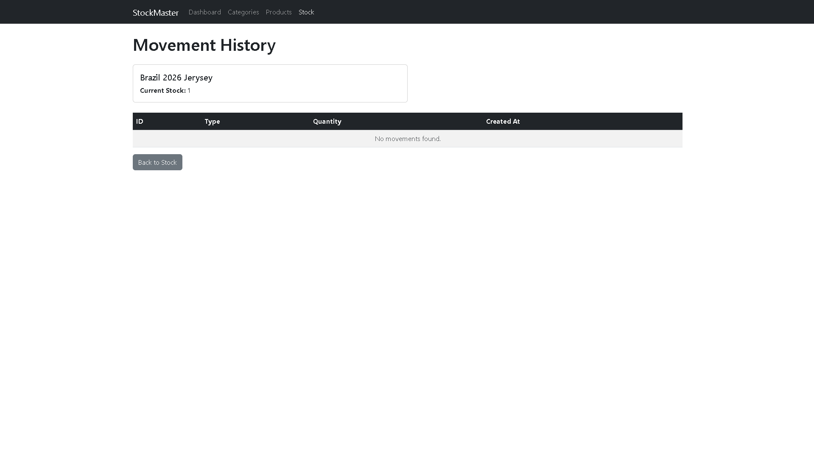

<<<<<<< HEAD
# StockMaster Inventory

A web-based inventory management application built with **Java** and **Spring Boot**. StockMaster helps businesses organize products by category, track stock levels, and record every stock entry and exit with full movement history.

---

## Project Overview

**StockMaster Inventory** is a full-stack monolithic application designed as a portfolio project to demonstrate modern Java backend development combined with server-side rendering. The system provides a clean interface for managing categories, products, and stock movements, with a dashboard that summarizes key inventory metrics in real time.

The application follows a layered architecture (Controller → Service → Repository) and uses **Spring Data JPA** for persistence against an in-memory **H2 Database**, making it easy to run locally without external dependencies.

---

## Features

- **Dashboard** — Overview with total categories, total products, total stock quantity, and recent stock movements
- **Category Management** — Create and list product categories with validation
- **Product Management** — Register products with name, description, price, quantity, and category assignment
- **Stock Management** — Register stock entries and exits with business rule enforcement
- **Movement History** — View per-product stock movement audit trail
- **Validation** — Server-side validation using Jakarta Bean Validation
- **Responsive UI** — Bootstrap 5 layout with navigation across all modules

### Business Rules

- Product price must be greater than zero
- Product quantity cannot be negative
- Stock entry increases product quantity
- Stock exit decreases product quantity
- Stock exit is blocked when quantity exceeds available stock

---

## Technologies

| Technology | Purpose |
|---|---|
| **Java 21** | Core programming language |
| **Spring Boot 4** | Application framework |
| **Spring Data JPA** | ORM and repository abstraction |
| **Spring MVC** | Web layer and request handling |
| **Thymeleaf** | Server-side HTML templating |
| **Bootstrap 5** | Responsive UI styling |
| **H2 Database** | In-memory relational database |
| **Lombok** | Boilerplate reduction (getters, setters, constructors) |
| **Maven** | Build and dependency management |
| **Git** | Version control |

---

## Architecture

StockMaster follows a classic **three-layer architecture** with a clear separation of concerns:

```
┌─────────────────────────────────────────────────────────────┐
│                        Browser (Client)                     │
└─────────────────────────────┬───────────────────────────────┘
                              │ HTTP
┌─────────────────────────────▼───────────────────────────────┐
│                     Controller Layer                        │
│  CategoryController │ ProductController │ StockMovementCtrl  │
└─────────────────────────────┬───────────────────────────────┘
                              │
┌─────────────────────────────▼───────────────────────────────┐
│                      Service Layer                          │
│   CategoryService │ ProductService │ StockMovementService    │
└─────────────────────────────┬───────────────────────────────┘
                              │
┌─────────────────────────────▼───────────────────────────────┐
│                    Repository Layer                         │
│ CategoryRepository │ ProductRepository │ StockMovementRepo   │
└─────────────────────────────┬───────────────────────────────┘
                              │ JPA / Hibernate
┌─────────────────────────────▼───────────────────────────────┐
│                      H2 Database                            │
│         categories │ products │ stock_movements             │
└─────────────────────────────────────────────────────────────┘
```

### Package Structure

```
com.vitorpht.stockmasterinventory
├── controller/     # HTTP endpoints and view routing
├── service/        # Business logic and transactions
├── repository/     # Data access interfaces
└── model/          # JPA entities and enums
```

---

## Database Model

```
┌──────────────────┐       ┌──────────────────┐       ┌──────────────────┐
│    categories    │       │     products     │       │ stock_movements  │
├──────────────────┤       ├──────────────────┤       ├──────────────────┤
│ id (PK)          │◄──┐   │ id (PK)          │◄──┐   │ id (PK)          │
│ name             │   └───│ category_id (FK) │   └───│ product_id (FK)  │
│ created_at       │       │ name             │       │ type (ENUM)      │
└──────────────────┘       │ description      │       │ quantity         │
                           │ price            │       │ created_at       │
                           │ quantity         │       └──────────────────┘
                           │ created_at       │
                           └──────────────────┘

Relationship: Category 1 ── * Product 1 ── * StockMovement
```

### Category

Represents a product classification group (e.g., Electronics, Clothing).

| Field | Type | Description |
|---|---|---|
| `id` | Long | Primary key, auto-generated |
| `name` | String | Category name (required, not blank) |
| `createdAt` | LocalDateTime | Timestamp set automatically on creation |

**Table:** `categories`

---

### Product

Represents an inventory item linked to a single category.

| Field | Type | Description |
|---|---|---|
| `id` | Long | Primary key, auto-generated |
| `name` | String | Product name (required, not blank) |
| `description` | String | Optional product description |
| `price` | BigDecimal | Unit price (must be > 0) |
| `quantity` | Integer | Current stock level (must be ≥ 0) |
| `category` | Category | Many-to-one relationship |
| `createdAt` | LocalDateTime | Timestamp set automatically on creation |

**Table:** `products`

---

### StockMovement

Records every stock entry or exit for audit and traceability.

| Field | Type | Description |
|---|---|---|
| `id` | Long | Primary key, auto-generated |
| `product` | Product | Many-to-one relationship |
| `type` | MovementType | `ENTRY` or `EXIT` |
| `quantity` | Integer | Moved quantity (must be > 0) |
| `createdAt` | LocalDateTime | Timestamp set automatically on creation |

**Table:** `stock_movements`

**Enum `MovementType`:** `ENTRY` increases stock · `EXIT` decreases stock

---

## Screenshots

> Replace the placeholder paths below with your actual screenshot files.

### Dashboard



*Overview with inventory statistics and recent stock movements.*

---

### Categories



*Category listing with ID, name, and creation date.*


*Form for creating a new category.*

---

### Products



*Product listing with category, price, and stock quantity.*


*Form for registering a new product.*

---

### Stock Management



*Stock management page with entry, exit, and history actions.*


*Stock entry form.*



*Per-product movement history.*

---

## Installation

### Prerequisites

- **Java 21** or higher
- **Maven 3.9+** (or use the included Maven Wrapper)
- **Git**

### Clone the Repository

```bash
git clone https://github.com/your-username/stockmaster-inventory.git
cd stockmaster-inventory
```

---

## Running the Project

### Using Maven Wrapper (recommended)

**Windows:**

```bash
.\mvnw.cmd spring-boot:run
```

**Linux / macOS:**

```bash
./mvnw spring-boot:run
```

### Using Maven directly

```bash
mvn spring-boot:run
```

### Access the Application

Once started, open your browser at:

```
http://localhost:8080
```

### Run Tests

```bash
./mvnw test
```

---

## Future Improvements

- [ ] User authentication and role-based access control
- [ ] Product edit and delete functionality
- [ ] Category edit and delete functionality
- [ ] Product search and filter by category on the UI
- [ ] Low stock alerts and notifications
- [ ] Export inventory reports (PDF / CSV)
- [ ] Pagination for product and movement lists
- [ ] REST API layer for mobile or third-party integrations
- [ ] Migration to PostgreSQL or MySQL for production deployment
- [ ] Docker containerization for simplified deployment
- [ ] Unit and integration test coverage for services and controllers

---

## Author

Developed as a portfolio project demonstrating **Java**, **Spring Boot**, **Spring Data JPA**, **Thymeleaf**, and **Bootstrap** best practices.

---

## License

This project is open source and available for educational and portfolio purposes.
=======
# stockmaster-inventory
Inventory Management System built with Java, Spring Boot and SQL
>>>>>>> 9ff22666590440b030681c52c1d3a3946b4246bb
